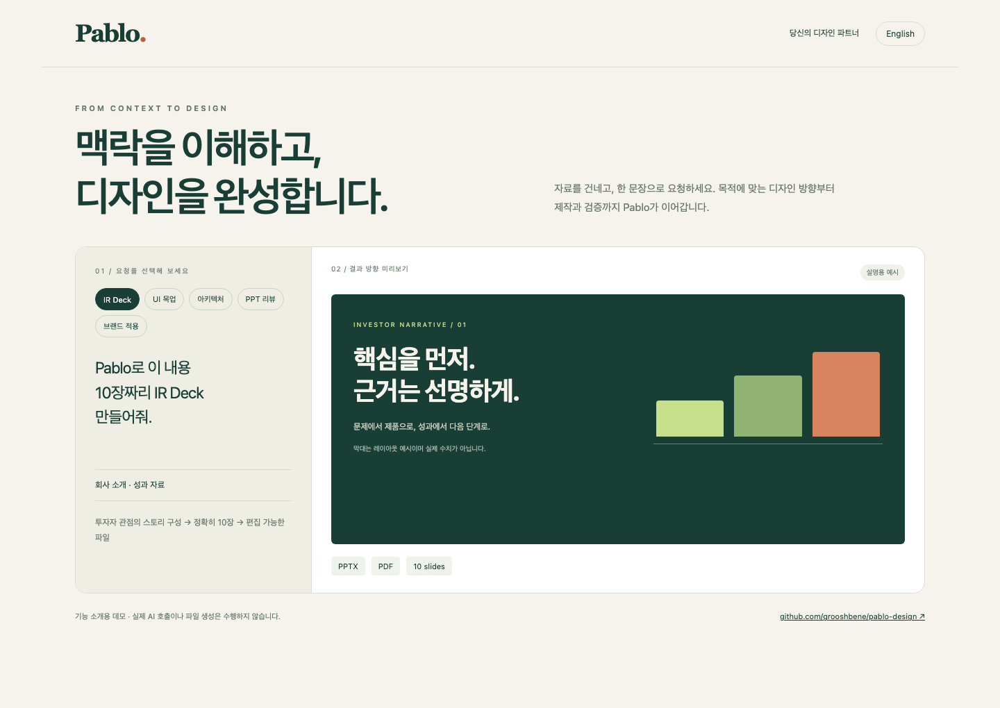

# Pablo

### 내용은 준비됐는데, 디자인에서 멈췄다면.

투자자에게 보낼 발표자료, 팀에 설명할 시스템 구조, 머릿속에만 있는 제품 화면.
**Pablo에게 자료를 건네고, 무엇으로 만들지 말해주세요.** 목적에 맞게 내용을 정리하고 디자인한 뒤, 수정해서 쓸 수 있는 결과물로 만드는 에이전트 스킬입니다.

```text
Pablo로 이 내용 10장짜리 IR Deck 만들어줘.
```

Codex처럼 **파일을 읽고 작업할 수 있는 에이전트에서 사용합니다.** 디자인 도구를 직접 조작하거나 작업마다 긴 프롬프트를 준비할 필요 없이, 평소 대화하듯 요청하세요.

[English](README.en.md) · [활용 예시](#이럴-때-pablo에게-맡겨보세요) · [시작하기](#시작하기) · [설치 도움말](docs/SETUP.md)



<sub>다섯 가지 작업 흐름을 보여주는 설명용 데모입니다. 실제 AI 실행 화면은 아닙니다. <a href="demos/pablo-demo.html">HTML 데모</a>를 내려받아 브라우저에서 열면 직접 전환해 볼 수 있습니다.</sub>

---

## 이럴 때 Pablo에게 맡겨보세요

### 문서로 흩어진 내용을, 발표할 수 있는 이야기로

회사 소개와 성과 자료를 첨부하고 요청하세요.

> Pablo로 이 내용 10장짜리 IR Deck 만들어줘. 투자자가 제품과 성장 근거를 빠르게 이해할 수 있게 구성해줘.

슬라이드별 핵심 메시지를 잡고, **편집 가능한 PPTX와 PDF 미리보기**로 만듭니다. 요청한 장수를 지키며, 자료에 없는 매출이나 시장 규모를 임의로 채우지 않습니다.

### 설명하기 어려운 화면을, 눈으로 볼 수 있게

스크린샷이나 화면 설명을 전달하세요.

> Pablo로 이 화면 UI 목업 만들어줘. 지금 구조는 유지하고, 중요한 버튼이 더 잘 보이게 해줘.

정보의 우선순위와 배치를 다듬어 **브라우저에서 볼 수 있는 목업과 소스**를 만듭니다. 필요한 클릭·입력 동작은 데모로 구현하고 확인합니다.

### 복잡한 시스템을, 한눈에 설명할 수 있게

설계 문서나 프로젝트의 관련 파일을 지정하세요.

> Pablo로 이 시스템 아키텍처 시각화해줘. 서비스 사이의 데이터 흐름과 외부 연동을 구분해줘.

구성 요소와 연결 관계를 정리해 **수정 가능한 다이어그램**으로 표현합니다. 확인된 구조와 추정한 부분을 구분합니다.

### 내용은 좋은데 아쉬운 PPT를, 다시 쓸 수 있게

기존 PPT 파일을 첨부하세요.

> Pablo가 이 PPT 디자인 리뷰하고 수정해줘. 내용은 유지하고, 글자 크기와 정렬, 시각적인 흐름을 개선해줘.

슬라이드별 문제를 짚고 **실제 수정본까지** 만듭니다. 리뷰만 필요하면 “리뷰해줘”라고 요청하세요. 원본은 남겨둡니다.

### 서로 다른 디자인을, 우리 회사답게

기존 디자인에 로고·브랜드 가이드·회사 템플릿을 함께 전달하세요.

> Pablo로 이 디자인을 회사 브랜드에 맞춰 다시 만들어줘. 첨부한 가이드의 색상과 서체를 적용해줘.

색상뿐 아니라 글자 계층, 여백, 이미지와 차트 표현을 맞춥니다. **내용은 유지하고, 브랜드에 맞춘 새 버전**을 받습니다.

---

## 시작하기

### 1. 처음 한 번, 작업 환경을 준비하세요

작업할 에이전트와 **Node.js·Python 3·Git**이 준비되어 있다면 터미널에서 실행하세요.

```bash
git clone https://github.com/GrooshBene/pablo-design.git
cd pablo-design
./pablo setup
```

Pablo가 사용하는 제작·검증 도구를 이 폴더 안에 설치합니다. Node.js와 Python 자체를 설치해 주는 명령은 아닙니다. **PPTX 작업은 추가 준비가 필요합니다:** macOS의 HTML→PPTX 변환에는 Chrome, PPTX 미리보기 생성에는 LibreOffice가 필요합니다. [설치 조건과 점검 방법 →](docs/SETUP.md)

<details>
<summary>이미 에이전트 스킬을 사용하고 있다면</summary>

```bash
npx skills add GrooshBene/pablo-design
```

스킬 이름은 `pablo`입니다. 설치된 Pablo 폴더에서 `./pablo setup`도 실행해 제작 환경을 준비하세요. 스킬 설치는 에이전트에게 작업 방법을 알려주고, 환경 설치는 실제 파일을 만드는 도구를 준비합니다. [자세한 안내 →](docs/SETUP.md#스킬로-설치)

</details>

### 2. 에이전트에서 폴더를 열고, 자료를 전달하세요

내려받은 **`pablo-design` 폴더를 에이전트의 작업 프로젝트로 여세요.** 이 프로젝트의 지침이 Pablo 요청을 연결합니다. 다른 프로젝트에서도 사용하려면 위의 스킬 설치 방식을 사용하세요.

문서·PPT·스크린샷을 첨부하거나 파일 경로를 알려주면 됩니다. “이 내용”이라고 요청할 때는 어떤 자료인지 함께 전달해주세요.

### 3. 만들고 싶은 결과를 말하세요

> Pablo로 첨부한 회사 소개를 10장짜리 IR Deck으로 만들어줘.

Pablo가 자료를 읽고 디자인 방향을 판단해 제작과 검증을 진행합니다. 방향을 직접 고르고 싶다면 “시안 세 개를 먼저 보여줘”를 덧붙이세요. 자료가 없거나 중요한 내용이 모호할 때는 필요한 질문을 합니다.

**이 문장은 터미널이 아닌 에이전트 대화창에 입력합니다.**

---

## 첫 요청 이후에도, 대화로 다듬으세요

결과를 보고 원하는 부분만 이어서 말하면 됩니다.

```text
3번째 슬라이드만 수정해줘. 제목을 더 크게 하고 본문을 줄여줘.

이 목업에서 버튼을 누르면 상세 화면이 열리게 해줘.

이 다이어그램에 외부 결제 서비스와 연결되는 부분을 표시해줘.

지금 디자인은 유지하고 회사 브랜드 색상만 적용해줘.
```

디자인 용어를 몰라도 괜찮습니다. **“누가 볼지, 무엇이 잘 보였으면 하는지”**를 알려주는 것만으로도 방향을 잡는 데 도움이 됩니다. 수정 요청은 현재 결과물과 선택한 방향을 이어받습니다.

## 결과물은 어떻게 받나요?

작업이 끝나면 파일 링크와 주요 변경, 확인한 내용을 받습니다. 별도 위치를 지정하지 않으면 `outputs/<작업명>/`에 저장합니다.

- **원본을 보존합니다.** 수정본은 새 버전으로 만듭니다.
- **홍보 워터마크를 기본으로 넣지 않습니다.** 회사나 고객에게 전달할 자료에 도구 이름을 자동으로 붙이지 않습니다.
- **확인하지 못한 부분을 알려줍니다.** 복잡한 PPT 차트·애니메이션·마스터는 편집 도구에 따라 보존이 제한될 수 있습니다.

Pablo는 에이전트와 로컬 도구가 함께 작업하는 스킬입니다. 실제 결과는 입력 자료와 사용 가능한 도구에 따라 달라지며, 중요한 발표자료는 최종 사용할 앱에서도 확인해주세요.

---

## 더 알아보기

| 궁금한 내용 | 안내 |
|---|---|
| 설치가 안 되거나 환경을 확인하고 싶어요 | [설치·실행 안내](docs/SETUP.md) |
| 변환·검증 명령을 직접 실행하고 싶어요 | [로컬 도구 사용법](docs/SETUP.md#실행-확인) |
| Pablo가 어떤 기준으로 작업하나요? | [작업 지침](SKILL.md) |
| 자료가 외부로 전송되나요? | [데이터 전송 안내](SECURITY.md) |

## 출처와 라이선스

Pablo는 Huashu Design의 제작 도구와 디자인 자료를 기반으로 확장했습니다. 원저작자 고지를 보존합니다. [출처 안내](ATTRIBUTION.md) · [MIT License](LICENSE)
